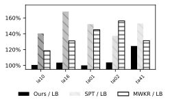
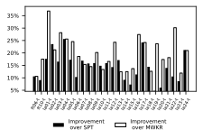

================================
JobShopLab
================================
.. image:: ../assets/JobShopLabLogo.svg
   :width: 150px
   :align: center
   :alt: JobShopLab Logo

JobShopLab is a flexible and modular framework designed to advance research and development in job shop scheduling using Reinforcement Learning (RL) techniques. It provides an adaptable gym environment, enabling users to test and benchmark different scheduling algorithms under realistic constraints found in industrial settings.

.. image:: ../assets/3d_sim.gif
   :width: 600px
   :align: center
   :alt: 3D Simulation of JobShopLab

The GIF above showcases our framework in action, visualizing an automated production process where an RL agent dynamically assigns task to machines and vehicles. Colored blocks represent orders moving through different production stations, while AI makes real-time decisions to optimize order allocation and scheduling.

Features
------------

- **Modular Gym Environment**: A customizable and extensible framework for testing diverse scheduling strategies and problem specifications.
- **Reinforcement Learning Ready**: Seamless integration with RL algorithms via the standard Gym Interface.
- **Real-World Constraints**: Incorporates transport logistics, buffer management, machine breakdowns, setup times, and stochastic processing conditions.
- **Multi-Objective Optimization**: Supports scheduling based on multiple objectives, such as makespan, energy efficiency, machine utilization, and lead time.
- **Pip Installable**: Easy installation from the repository, ensuring quick setup and integration into existing projects.

Installation
------------

To install JobShopLab, clone the repository and install it in editable mode using `pip`.

.. code-block:: bash

    cd <desired_dir>

    # ssh
    git clone git@github.com:proto-lab-ro/jobshoplab.git

    # or https
    git clone https://github.com/proto-lab-ro/jobshoplab.git
  # install python module in edible mode
    pip install -e <repo_dir>

Replace `<desired_dir>` with your target directory and `<repo_dir>` with the path to your local clone of the JobShopLab repository.

Getting Started
---------------

.. note::
   JobShopLab requires Python 3.12 or higher.

After installation, you can initialize and interact with JobShopLab in your Python scripts as follows:

.. code-block:: python

    from jobshoplab import JobShopLabEnv, load_config
    from pathlib import Path
    
    # Load a pre-defined configuration
    config = load_config(config_path=Path("./data/config/getting_started_config.yaml"))
    
    # Create the environment
    env = JobShopLabEnv(config=config)
    
    # Run with random actions until done
    done = False
    while not done:
        action = env.action_space.sample()
        obs, reward, truncated, terminated, info = env.step(action)
        done = truncated or terminated
    
    # Visualize the final schedule
    env.render()

We also provide a **Getting Started Jupyter Notebook** that walks you through the framework setup, environment interaction, and running basic reinforcement learning experiments. You can find this notebook in the repository under `jupyter/getting_started.ipynb`.

.. .. raw:: html

..    

..    graph TD
..        Agent[RL Agent] <-->|Actions/Observations| GymEnv[Gym Environment]
..        GymEnv <-->|Interface| Middleware
..        Middleware <-->|Interface| StateMachine[State Machine]
..        StateMachine -->|Updates| State[State]
..        GymEnv -->|Renders| Visualization[Visualization]
..    

Framework Overview
-------------------

JobShopLab extends the classical Job Shop Scheduling Problem (JSSP) by integrating real-world production constraints and enabling RL-based optimization. It provides a state-machine-based simulation model that includes:

- **Machines**: Modeled with setup times, breakdowns, and stochastic processing.
- **Transport Units**: Handling job movements between machines with delays and constraints.
- **Buffers**: Limited storage capacity impacting scheduling decisions.

Experiments
-----------
To validate the framework, we trained an RL agent and compared its scheduling performance against traditional Priority Dispatch Rules (PDRs). Using the PPO algorithm from Stable Baselines3, the agent learned to optimize makespan efficiently. Compared to heuristic methods like Shortest Processing Time (SPT) and Most Work Remaining (MWKR), the RL-based approach achieves superior scheduling performance out of the box, in the standard academic cases and also with significantly increased complexity due to additional constraints such as buffer and transport constraints.
**Academic Instances**
Academic instances found in Literature. Definitions can be found in `data/jssp_instances/*.yaml`

*Note on RL Results*: Results from individual hyperparameter optimizations 

**Extendet real-world constrains**
*Academic instances with arbitrary transport times between machines
definitions can be found in 
`data/instances/jssptransport/*.yaml`

*Note on RL Results*: training was performed with one set of hyperparameter over all instances

Testing
--------

JobShopLab uses pytest for testing. The test suite includes unit tests, integration tests, and end-to-end tests.

To run the tests, execute the following commands:

.. code-block:: bash

    # Run all tests
    pytest
    # Run tests with coverage report
    ./scripts/get_test_coverage.sh
    # Run specific test categories
    pytest tests/unit_tests/
    pytest tests/integration_tests/

Contributing
------------

We welcome contributions to JobShopLab! If you have ideas for improvements or bug fixes, feel free to submit an issue or pull request on our repository.

How to Contribute
-----------------

1. Fork the repository.
2. Create a new branch for your feature or fix.
3. Implement your changes and ensure they are well-documented.
4. Submit a pull request with a detailed explanation of your modifications.

Contents
--------
.. toctree::
   :maxdepth: 1
   :caption: Userguide

   user_guide/getting_started
   user_guide/framework_config
   user_guide/custom_instances
   user_guide/custom_rewards
   user_guide/custom_observations
   user_guide/visualisation
   user_guide/testing

.. toctree::
   :maxdepth: 1
   :caption: Concepts
   
   concepts/design_choices
   concepts/state_machine
   concepts/middleware
   concepts/the_dsl

.. toctree::
   :maxdepth: 3
   :caption: API Reference

   _modules/modules

.. toctree::
   :maxdepth: 1
   :caption: Additional Resources

   additional_resources/contributing
   additional_resources/next_steps
   additional_resources/authors
