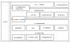

Getting Started
===============

JobShopLab is a framework for solving real-world job shop scheduling scenarios using reinforcement learning. This guide provides examples and explanations on how to use the framework.

Installation
------------

.. note::
   Ensure you have the required Python  3.12 or higher installed before proceeding.

To install JobShopLab, clone the repository and install it in editable mode using ``pip``.

.. code-block:: bash

    cd <desired_dir>

    # ssh
    git clone git@github.com:proto-lab-ro/jobshoplab.git

    # or https
    git clone https://github.com/proto-lab-ro/jobshoplab.git
    # install python module in editable mode
    pip install -e <repo_dir>

.. note::
   Replace ``<desired_dir>`` with your target directory and ``<repo_dir>`` with the path to your local clone of the JobShopLab repository.

Example: Solving an ft06 Instance with a Random Policy
-------------------------------------------------------

The following example demonstrates how to solve an academic ft06 instance using a random policy.

.. code-block:: python

    from jobshoplab import JobShopLabEnv, load_config
    from pathlib import Path

    config = load_config(config_path=Path("./data/config/getting_started_config.yaml"))
    env = JobShopLabEnv(config=config)
    done = False
    while not done:
        action = env.action_space.sample()
        obs, reward, truncated, terminated, info = env.step(action)
        done = truncated or terminated
    env.render()

Design Choices
--------------

JobShopLab is designed to be fully extensible and customizable.

At its core is a state machine implemented in a functional programming style. The state machine takes inputs and produces outputs using an immutable data type object (interface).

To address the need for various time mechanisms, observation spaces, and action spaces, a software layer called *Middleware* is used. The Middleware sits between the Gym environment and the state machine, translating the Gym interface to the state machine interface.

.. note::
   Observation, reward, and action factories are injected into the Middleware to allow customization. Their interfaces are represented by data type objects (dataclasses).

Rendering
~~~~~~~~~

Rendering is performed via a dashboard built with Dash. The dashboard displays a central Gantt chart and a table with all schedules. Dashboards can be shown inline in a Jupyter Notebook or in a web browser.

.. hint::
   Additional rendering utilities are available for debugging, and a 3D simulation web app can also be accessed via the browser.

Configuration Management
~~~~~~~~~~~~~~~~~~~~~~~~

A critical aspect of maintaining a framework like JobShopLab and ensuring reproducible results is proper configuration management.

There are two types of configurations to consider:

1. **Framework Config**  
   A YAML file containing configuration parameters that control the behavior of the framework.  
   *Examples:* Setting the observation space, render modes, and truncation behavior.

2. **Problem Instance Config**  
   A DSL file (a domain-specific language in YAML syntax) that defines the scheduling problem.  
   *Examples:* Setting machine times and operation sequences, defining buffer settings, and setting machine setup times.

Configuring the Framework
--------------------------

The framework can be configured in two ways:

- Via a **config.yaml** file
- Via **dependency injection**

.. note::
   A configuration file is always required, but it can be overridden using dependency injection. While dependency injection is useful for testing new components quickly, the recommended approach is to use configuration objects.

Config File
~~~~~~~~~~~

Framework configuration files are written in YAML. The YAML is parsed dynamically into a Python dataclass object, which provides dot notation attribute access, autocompletion, type safety, and validation.

Below is an example configuration file for JobShopLab:

.. code-block:: yaml

    # Example configuration file for JobShopLab

    title: "Example Environment"
    default_loglevel: "warning"  # JobShopLab uses the logging module with a Logger object for verbosity.

    # Define all dependencies for the environment here.
    env:
        loglevel: "warning"
        observation_factory: "BinaryActionObservationFactory"
        reward_factory: "BinaryActionJsspReward"
        interpreter: "BinaryJobActionInterpreter"
        render_backend: "render_in_dashboard"
        middleware: "EventBasedBinaryActionMiddleware"
        max_time_fct: 2
        max_action_fct: 3

    # For every software component there is a designated field.
    compiler:
        loglevel: "warning"
        repo: "SpecRepository"  # Set to "YamlRepository" to use custom problem instances.
        validator: "SimpleDSLValidator"
        manipulators:
            - "DummyManipulator"
        yaml_repository:
            dir: "data/config/instance_proto_lab.yaml"
        spec_repository:
            dir: "data/jssp_instances/ft06"
    state_machine:
        loglevel: "warning"

    middleware:
        event_based_binary_action_middleware:
            loglevel: "warning"
            truncation_joker: 5
            truncation_active: False

    interpreter:
        binary_job_action_interpreter:
            loglevel: "warning"
        # Additional settings for new action interpreters can be added here.

    observation_factory:
        binary_action_observation_factory:
            loglevel: "warning"

    reward_factory:
        binary_action_jssp_reward:
            loglevel: "warning"
            sparse_bias: 1
            dense_bias: 0.001
            truncation_bias: -1

    render_backend:
        render_in_dashboard:
            loglevel: "warning"
            port: 8050
            debug: False
        simulation:
            json_dump_dir: "data/tmp/simulation_interface.json"
            port: 8051
            loglevel: "warning"
            bind_all: False

.. warning::
   The configuration object is immutable. Any attempt to modify its attributes (as shown in the next example) will result in an error.

To load the configuration file and create an environment:

.. code-block:: python

    from jobshoplab import JobShopLabEnv, load_config
    from pathlib import Path

    # Load the configuration file.
    config = load_config(config_path=Path("./data/config/getting_started_config.yaml"))

    # Access config attributes using dot notation.
    print(f"Dashboard Port: {config.render_backend.render_in_dashboard.port}")

    # The configuration is immutable to prevent accidental changes.
    try:
        config.render_backend.render_in_dashboard.port = 1000
    except AttributeError as e:
        print(f"Error: {e}")

    # Create an environment with the loaded configuration.
    env = JobShopLabEnv(config=config)

Dependency Injection
~~~~~~~~~~~~~~~~~~~~

The environment allows you to pass dependencies directly as constructor arguments. The passed instances are constructed inside the environment, and additional arguments not included in the config file can be provided via partial application. This supports dynamic instance creation (useful for hyperparameter optimization), rapid experiment implementation, and customization.

.. note::
   Dependency injection is particularly useful when you need to test new components or override default behaviors quickly.

.. raw:: html

    

    flowchart LR
         A[Default Components] --> B[JobShopLabEnv]
         C[Custom Component]
         C --> B
         %% Note: Dependency Injection overrides default implementations.
         C ---|Overrides| A
    

Example using dependency injection with a dummy observation factory:

.. code-block:: python

    from jobshoplab.env.factories.observations import DummyObservationFactory
    from functools import partial
    from jobshoplab import JobShopLabEnv, load_config
    from pathlib import Path

    config = load_config(config_path=Path("./data/config/getting_started_config.yaml"))

    # Use a dummy observation factory that returns a random observation.
    observation_factory = DummyObservationFactory

    # Pass additional arguments to the observation factory using partial application.
    observation_factory = partial(DummyObservationFactory, test_var="test_var")

    env = JobShopLabEnv(config=config, observation_factory=observation_factory)
    assert isinstance(env.state_simulator.observation_factory, DummyObservationFactory)
    assert env.state_simulator.observation_factory.test_var == "test_var"

Customizing
~~~~~~~~~~~

Want to introduce a new reward system? The framework provides base classes for every factory, enabling easy customization. This applies to the observation factory and the action interpreter as well; abstract base classes define their interfaces.

.. hint::
   Customizing these components allows you to tailor JobShopLab to fit your specific scheduling and reinforcement learning needs.

For example, you can define a custom reward factory as follows:

.. code-block:: python

    from jobshoplab.env.factories.rewards import RewardFactory
    from jobshoplab.types import StateMachineResult

    class CustomRewardFactory(RewardFactory):
        def __init__(self, loglevel, config, instance, bias_a, bias_b, *args, **kwargs):
            # Call the parent constructor to initialize loglevel, config, and instance.
            self.test_var = super().__init__(loglevel, config, instance)
            self.bias_a = bias_a
            self.bias_b = bias_b

        def make(self, state_result: StateMachineResult, terminated: bool, truncated: bool) -> float:
            if not terminated or truncated:
                return self.bias_a
            else:
                # Return a reward proportional to the time taken (makespan).
                return self.bias_b * state_result.state.time.time

        def __repr__(self) -> str:
            return f"CustomRewardFactory with bias_a: {self.bias_a}, bias_b: {self.bias_b}"

    bias_a, bias_b = 0, 1
    from functools import partial
    reward_factory = partial(CustomRewardFactory, bias_a=bias_a, bias_b=bias_b)
    env = JobShopLabEnv(config=config, reward_factory=reward_factory)
    assert env.reward_factory.bias_a == bias_a

    # Run a random environment and track the rewards.
    done = False
    rewards = []
    while not done:
        action = env.action_space.sample()
        obs, reward, truncated, terminated, info = env.step(action)
        done = truncated or terminated
        rewards.append(reward)

    print(f"Rewards: {rewards}")

Defining a Problem
------------------

There are three ways to specify the problem instance:

.. raw:: html

    

    flowchart LR
         A[Dsl file] --> D[DslRepo]
         D --> G[AbstractRepo]
         G --> H[Compiler]
         B[Spec file] --> E[SpecRepo]
         E --> G
         C[Dsl String] --> F[DslStrRepo]
         F --> G
         H --> I[Env]
    

1. **Spec File:** Academic JSSP problem definitions commonly found in the literature.
2. **DSL File:** A YAML file that defines the scheduling problem in a flexible way for real-world scenarios.
3. **DSL String:** Useful for Jupyter notebooks or for testing and debugging purposes.

Spec Files
~~~~~~~~~~

Spec files are academic JSSP problem instances as found in the literature. Common instances are included in JobShopLab. To use them, specify the SpecRepository in your configuration file:

.. code-block:: yaml

    compiler:
      loglevel: *default_loglevel
      repo: "SpecRepository"  # Use the SpecRepository here.
      validator: "SimpleDSLValidator"
      manipulators:
        - "DummyManipulator"
      yaml_repository:
        dir: "data/config/dsl.yaml"
      spec_repository:
        dir: "data/jssp_instances/ft06"

Alternatively, you can use dependency injection:

.. code-block:: python

    from jobshoplab.compiler.repos import SpecRepository
    from jobshoplab.compiler import Compiler
    from pathlib import Path

    repo = SpecRepository(dir=Path("data/jssp_instances/ft06"), loglevel="warning", config=config)
    compiler = Compiler(config=config, loglevel="warning", repo=repo)
    env = JobShopLabEnv(config=config, compiler=compiler)

The Compiler
~~~~~~~~~~~~

The compiler generates two interfaces used throughout JobShopLab:

- **Instance:** A dataclass object holding all the information about the problem.
- **(Initial) State:** A dataclass object representing the current state of the schedule. Since the state is time-dependent, every state includes a time attribute.

.. note::
   The compiler aggregates inputs from various sources (which can be overridden via dependency injection) and compiles a generic interface for the scheduling problem.

.. code-block:: python

    from jobshoplab.types import InstanceConfig, State

    # The compile method returns the compiled instance and the initial state.
    instance, init_state = compiler.compile()

    print("Instance")
    print("Some Machine ID:", instance.machines[0].id)
    print("Operation Duration:", instance.instance.specification[0].operations[0].duration)

    print("\nState:")
    print("Time:", init_state.time)
    print("Machine State:", init_state.machines[0].state)

DSL
~~~

The primary purpose of JobShopLab is to represent real-world scheduling problems. Therefore, the DSL (instance.yaml) provides a way to specify the problem itself.

To set up a DSL repository, specify the DSL file path in the configuration file:

.. code-block:: yaml
    compiler:
    loglevel: *default_loglevel
    repo: "DslRepository" # <- set the repo here
    validator: "SimpleDSLValidator"
    manipulators:
        - "DummyManipulator"
    dsl_repository:
        dir: "data/config/dsl.yaml" # <- set the filepath here
    spec_repository:
        dir: "data/jssp_instances/ft06"

Alternatively use dependency injection:

.. code-block:: python
    from jobshoplab.compiler.repos import DslRepository
    from jobshoplab.compiler import Compiler

    repo = DslRepository(dir=Path("data/config/getting_started_instance.yaml"),loglevel="warning",config=config)
    compiler = Compiler(config=config,loglevel="warning",repo=repo)
    # pass the compiler to the environment
    env = JobShopLabEnv(config=config, compiler=compiler)

DSL as a String
~~~~~~~~~~~~~~~~~

An instance can also be defined inline as a string. This approach is useful when working in Jupyter notebooks or for debugging and testing purposes.

.. note::
   Using a DSL string can simplify rapid prototyping or testing without the need for external YAML files.

.. code-block:: python

    dsl_str = """
    title: InstanceConfig

    # Example of a 6x6 instance with AGVs

    instance_config:
      description: "ft06 with AGVs"
      instance:
        description: "6x6"
        specification: |
          (m0,t)|(m1,t)|(m2,t)|(m3,t)|(m4,t)|(m5,t)
          j0|(2,1) (0,3) (1,6) (3,7) (5,3) (4,6)
          j1|(1,8) (2,5) (4,10) (5,10) (0,10) (3,4)
          j2|(2,5) (3,4) (5,8) (0,9) (1,1) (4,7)
          j3|(1,5) (0,5) (2,5) (3,3) (4,8) (5,9)
          j4|(2,9) (1,3) (4,5) (5,4) (0,3) (3,1)
          j5|(1,3) (3,3) (5,9) (0,10) (4,4) (2,1)

        transport:
          type: "agv"
          amount: 6
      logistics:
        specification: |
          m-0|m-1|m-2|m-3|m-4|m-5|in-buf|out-buf
          m-0|0 21 16 9 37 41 19 19
          m-1|21 0 13 15 17 23 8 8
          m-2|16 13 0 13 23 28 7 7
          m-3|9 15 13 0 31 35 14 14
          m-4|37 17 23 31 0 7 25 25
          m-5|41 23 28 35 7 0 24 24
          in-buf|19 8 7 14 25 24 0 0
          out-buf|19 8 7 14 25 24 0 0

    init_state:
      t-0:
        location: m-0
      t-1:
        location: m-1
      t-2:
        location: m-2
      t-3:
        location: m-3
      t-4:
        location: m-4
      t-5:
        location: m-5
    """

    from jobshoplab.compiler.repos import DslStrRepository
    from jobshoplab.compiler import Compiler

    repo = DslStrRepository(dsl_str=dsl_str, loglevel="warning", config=config)
    compiler = Compiler(config=config, loglevel="warning", repo=repo)
    env = JobShopLabEnv(config=config, compiler=compiler)

.. note::
   A full example and explanation of the DSL can be found in ``/data/examples/full_instance.yaml``.

Visualization
-------------
.. raw:: html

   

    flowchart LR
        ENV[gym.Env]
        RENDER{env.render}
        DEBUG[cli debug util]
        SIMULATION[3d rendering]
        DASH[gant chart]

        ENV -->|history & instance| RENDER
        RENDER -->|debug| DEBUG
        RENDER -->|dashboard| DASH
        RENDER -->|simulation| SIMULATION
   

JobShopLab provides three main methods for visualizing an environment's state:

1. **Gantt Chart Dashboard:** A Dash web application that displays schedules on a timeline.
2. **CLI Table:** A debugging table rendered using the rich library.
3. **Simulation WebApp:** A 3D simulation using Three.js to render scenes of the schedules (coming soon!).

The default render mode can be configured in the config.yaml. For example:

.. code-block:: yaml

    env:
      loglevel: *default_loglevel
      observation_factory: "BinaryActionObservationFactory"
      reward_factory: "BinaryActionJsspReward"
      interpreter: "BinaryJobActionInterpreter"
      render_backend: "render_in_dashboard"
      middleware: "EventBasedBinaryActionMiddleware"

    render_backend:
      render_in_dashboard:
        loglevel: *default_loglevel
        port: 8050
        debug: false

      simulation:
        json_dump_dir: "data/tmp/simulation_interface.json"
        port: 8051
        loglevel: *default_loglevel
        bind_all: false

      cli_table:
        loglevel: *default_loglevel

When calling ``env.render()``, you can pass a mode flag to select the render backend:

- **normal** (default): Uses the default backend from the configuration.
- **dashboard**: Displays the Dash Gantt chart.
- **simulation**: Activates the 3D simulation with Three.js.
- **debug**: Shows the rich CLI table.

Example visualization:

.. code-block:: python

    repo = DslStrRepository(dsl_str=dsl_str, loglevel="warning", config=config)
    compiler = Compiler(config=config, loglevel="warning", repo=repo)
    env = JobShopLabEnv(config=config, compiler=compiler)

    # Run the environment with random actions.
    done = False
    while not done:
        action = env.action_space.sample()
        obs, reward, truncated, terminated, info = env.step(action)
        done = truncated or terminated
    env.render()
    # Alternatively, you can use:
    # env.render(mode="simulation")
    # env.render(mode="debug")

Defining Agents and Solving the Environment
---------------------------------------------

For more details on defining agents and solving the environment using reinforcement learning algorithms, please refer to the jobshopagent repository.

Below is an example of training an agent using Stable Baselines3:

.. code-block:: python

    from stable_baselines3 import PPO
    from jobshoplab import JobShopLabEnv

    env = JobShopLabEnv(config=config)
    model = PPO("MultiInputPolicy", env, verbose=1)
    model.learn(total_timesteps=10)

Further Reading
---------------

For more detailed information, check out these additional resources:

- :doc:`Framework Configuration <user_guide/framework_config>` - Learn how to configure the framework
- :doc:`Custom Instances <user_guide/custom_instances>` - Create your own problem instances
- :doc:`Custom Rewards <user_guide/custom_rewards>` - Define custom reward functions
- :doc:`Custom Observations <user_guide/custom_observations>` - Customize observation spaces
- :doc:`Visualization Options <user_guide/visualisation>` - Explore visualization options
- :doc:`Testing <user_guide/testing>` - Learn how to test your components
- :doc:`Setup Times <user_guide/setup_times>` - Model sequence-dependent changeover times
- :doc:`Outages <user_guide/outages>` - Implement equipment failures and maintenance events
- :doc:`Stochastic Time Behavior <user_guide/stochastic_time_behavior>` - Add randomness to processing times
- :doc:`Contributing <additional_resources/contributing>` - Contribute to the JobShopLab project

.. note::
   These documents provide in-depth information and examples to help you further customize and extend JobShopLab.
