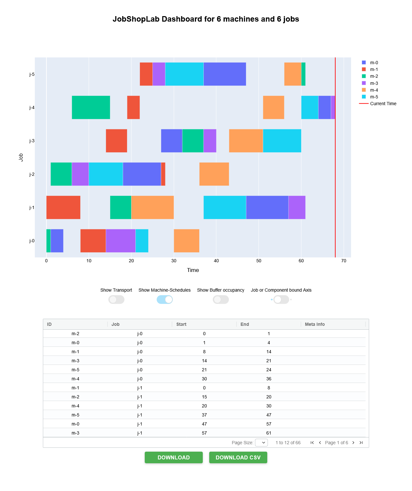

Visualisation
=============

JobShopLab provides powerful visualization tools to help understand and analyze scheduling results. This tutorial covers the available visualization options and how to use them effectively.

Visualization Methods
-------------------

JobShopLab supports three main visualization backends:

1. **Dashboard**: Interactive Gantt chart visualization using Dash
2. **Debug CLI**: Rich text-based visualization for debugging
3. **Simulation**: 3D visualization of the production environment

.. raw:: html

   

   graph LR
       Env[Environment] --> |history & instance| Render[env.render]
       Render -->|debug| Debug[CLI Debug Util]
       Render -->|dashboard| Gantt[Gantt Chart]
       Render -->|simulation| Simulation[3D Rendering]
   

Basic Usage
----------

To visualize scheduling results, use the `render` method:

.. code-block:: python

    # Create and run environment
    env = JobShopLabEnv(config=config)
    
    # Run simulation
    done = False
    while not done:
        action = env.action_space.sample()  # or your policy
        obs, reward, truncated, terminated, info = env.step(action)
        done = truncated or terminated
    
    # Visualize results with default backend
    env.render()
    
    # Or specify a backend
    env.render(mode="dashboard")  # Gantt chart
    env.render(mode="debug")      # CLI table
    env.render(mode="simulation") # 3D visualization

Configuring Visualization
-----------------------

Set the default visualization method in your config file:

.. code-block:: yaml

    env:
      render_backend: "render_in_dashboard"  # Default backend
    
    render_backend:
      render_in_dashboard:
        port: 8050
        debug: False
      
      cli_table:
        loglevel: "warning"
      
      simulation:
        port: 8051
        bind_all: False
        json_dump_dir: "data/tmp/simulation_interface.json"

Gantt Chart Dashboard
--------------------

The Gantt chart dashboard is the most comprehensive visualization tool:

.. code-block:: python

    # Show dashboard
    env.render(mode="dashboard")

Example of the JobShopLab Gantt chart dashboard showing job schedules and machine utilization

Dashboard Features:

- Interactive timeline of all operations
- Color-coded jobs and machines
- Zooming and panning
- Detailed tooltips with operation information
- Table view of job and machine status

When using the dashboard:

- The dashboard runs as a web application on the specified port (default: 8050)
- In Jupyter notebooks, it displays inline
- Otherwise, it opens in your default web browser

CLI Debug Visualization
---------------------

For quick debugging or when working in terminal environments:

.. code-block:: python

    # Show CLI table
    env.render(mode="debug")

The CLI visualization provides:

- A text-based representation of the schedule
- Machine timelines with operation codes
- Job completion status
- Current system state

This mode is particularly useful for:
- Debugging scheduling behavior
- Working in remote or terminal-only environments
- Quick checks during development

3D Simulation
------------

For a more immersive visualization of the production environment:

.. code-block:: python

    # Show 3D simulation
    env.render(mode="simulation")

The 3D simulation shows:

- Physical layout of machines
- Job movements between operations
- Transport resources (AGVs, conveyors)
- Buffers and queues

This visualization helps understand:
- Spatial aspects of scheduling
- Transport logistics
- Resource contentions
